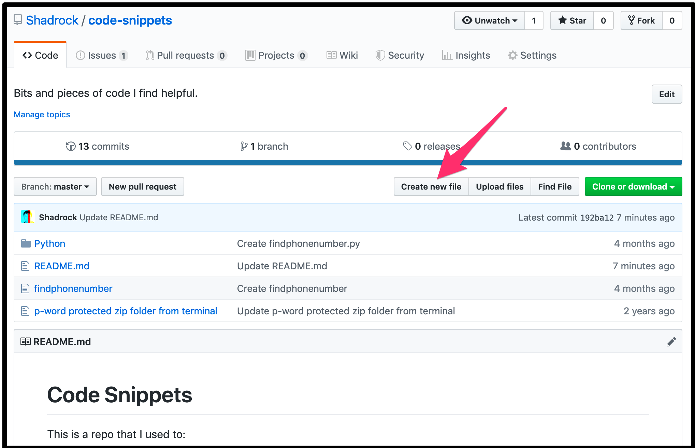
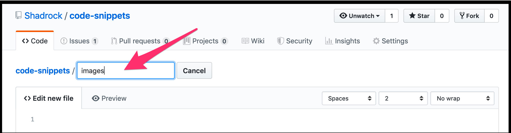
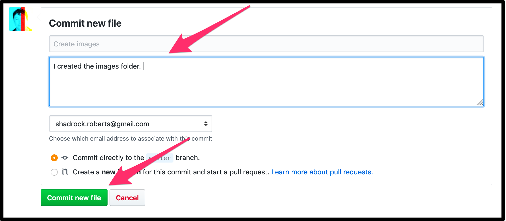
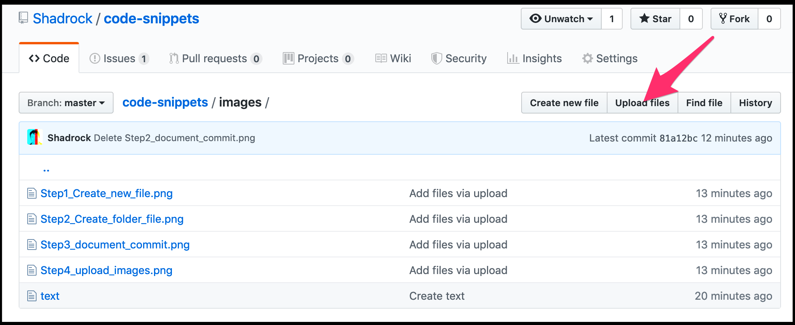

# Code Snippets
This is a repo that I use to:
- store bits and pieces of code I find helpful, and 
- demonstrate the amazing value of Markdown for Github repos.

## Some Examples
If this was a really amazing README, quote somebody who said:
> Wow, amazing repo. 

I might also need to **bold something**, *italicize something*, or ~~have stricken text strike~~ something out to show an edit or mistake. The best way to learn more is to practice with more Markdown: [check out Github's guide here](https://guides.github.com/features/mastering-markdown/).

## Adding Images
There's a very helpful [YouTube video](https://www.youtube.com/watch?reload=9&v=hHbWF1Bvgf4) for this if we don't get to it in class. 
### 1. Name your image.
Choose the image you want to use and give it a name that **does not use spaces!** So, "Scary_Shadrack_1803_1878.png" is fine but "Scary Shadrack 1803 1878.png" is not. 

### 2. Creating a new folder - in a few steps. 

In your repo, use "Create New File" to automatically create a new folder to place your image in. 


Github won't create an empty folder, so create a file and start by entering a name that you *want for your folder* (e.g. "images") and end that name with the / symbol, which creates the folder then prompts you provide a name for the file that will keep that folder open. I like to use "text" and then write a line of text in that file explaining that it's just a placeholder to create the folder. 


### 4. Save your changes!
Save by clicking the green "commit" button below. You can add details about the changes you're making if you like in the form fields there. These are just for documentation and won't appear on any of your pages. 


### 5. Add your images!
After you've created a folder by creating a file, open that folder by clicking on it from your repo. Then click the "Upload Files" button to drag and drop (or upload) your image file. 


### 6. Linking Images in your README file
After you've loaded your images, go back to your read me, click the editing button and link images wherever you want them in the text. 

To create a link in Markdown the syntax is ``````. Any text that you add in the 'Add text' spot will appear if the image can't load for some reason (you can leave it blank if you want). The 'Add link' spot is where you put your link. And the link is simply the folder name followed by the / followed by the complete image name. The last image on this page, for example, looks like this: ``````.
